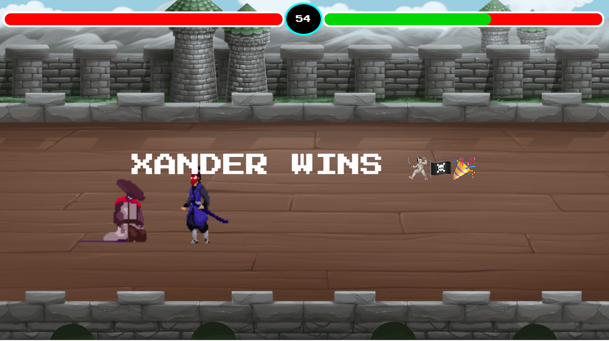

# Realm Of Steel - 2D Fighting Game

## Introduction

Realm Of Steel is a Samurai-themed 2D fighting game developed using JavaScript and HTML5 Canvas.

## Technologies Used

- JavaScript
- HTML
- CSS
- Canvas API

## How to Play

1. Visit the game's online version [here](https://realm-of-steel01.netlify.app/) to play directly in your browser.

## Game Controls

- Player 1:
  - Move Up: W
  - Move Left: A
  - Move Right: D
  - Basic Attack: SpaceBar

- Player 2:
  - Move Up: Up Arrow
  - Move Left: Left Arrow
  - Move Right: Right Arrow
  - Basic Attack: Enter

## Features

- Exciting 2D fighting gameplay with dynamic animations.
- Real-time health bars to monitor player and enemy health.
- A timer to add urgency and challenge to the battles.
- Intuitive controls for an immersive gaming experience.

## How to Contribute

Currently, Realm Of Steel is a personal project and not open for external contributions. However, feedback and suggestions are always welcome! If you encounter any issues or have ideas to improve the game, feel free to create an issue on the repository.

## Acknowledgments

- The game assets and animations were sourced from [Luiz Melo](https://luizmelo.itch.io/martial-hero) and [CraftPix] (https://craftpix.net/freebies/free-pixel-art-fantasy-2d-battlegrounds/)

- Game audio was sourced from [SamuraiShakuhachiSolo] (https://www.youtube.com/watch?v=vdJmqDDPi34&ab_channel=Orchestralis%2FBackgroundMusicForVideos)

- Special thanks to the GSAP animation library for enhancing the game's visual effects.

## License

This project is licensed under the [MIT License](LICENSE).

